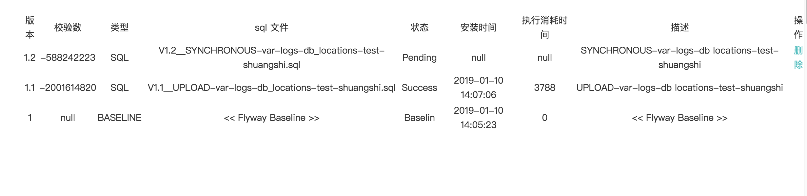
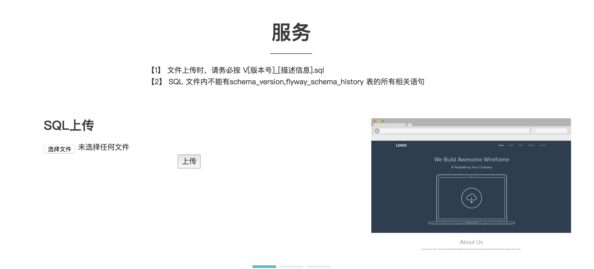
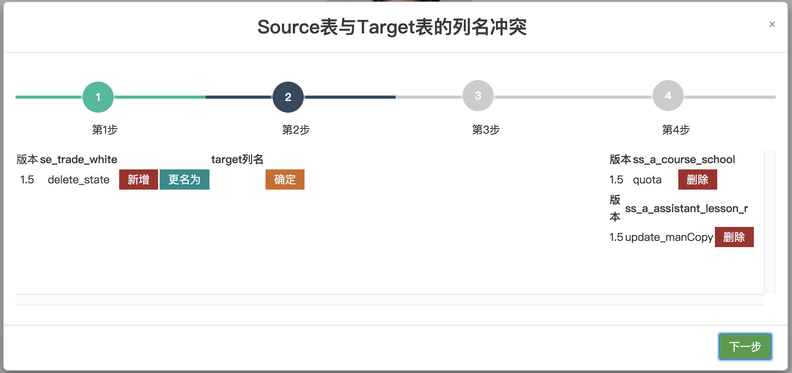
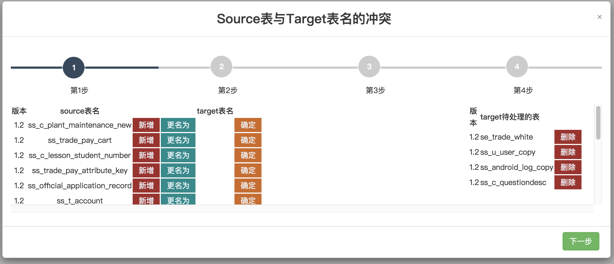
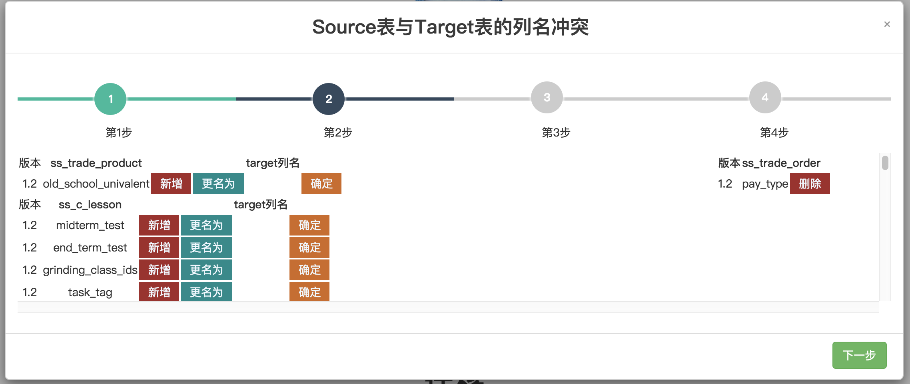
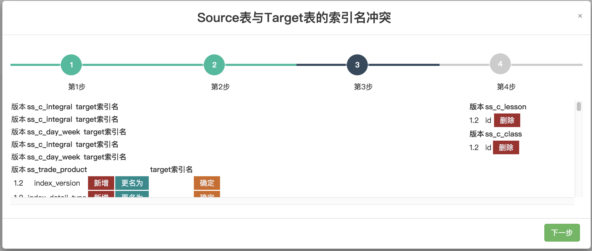
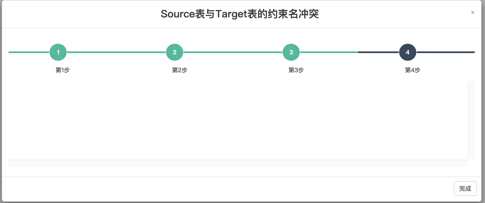

# DB-CONTROL-VERSION-SERVER
#### INTRODUCE
##### Synchronized database structure, version control.
- Synchronize the table, column, index and other information of two schemas between any two environments to solve the problem of database structure differences between different environments.<br/>
- eg.：The online environment BUG is caused by the change of development database due to the requirement of each new function on line.<br/>
- Changes include: database tables, table attributes, column names, column attributes, index names, index attributes.<br/>
- Currently, foreign keys and table spaces are not supported, because modern projects generally do not seem to need them.
- Currently only Mysql is supported.
- Provides an interface to support customization of certain fields.
 <br/>
#### SOFTWARE ARCHITECTURE
- Used SpringBoot 1.5.9.RELEASE
- Used Flyway for control version . 


#### INSTALLATION TUTORIAL

##### &emsp;A. CONFIGURE
   1. If you want to configure a single database schema: <br/>
       rule: sync_source_【database_schema_name】:  sync_target_【database_schema_name】source_1_url。。。 
    
        ```springdataql
        sync_source_shuangshi: 
          datasource:
            url: ${source_1_url:jdbc:mysql://127.0.0.1:3306/shuangshi?characterEncoding=utf-8&amp;zeroDateTimeBehavior=convertToNull}
            username: ${source_1_username:root}
            password: ${source_1_password:123456}
            driver-class-name: com.mysql.jdbc.Driver
        sync_target_shuangshi: 
          datasource:
            url: ${target_1_url:jdbc:mysql://172.16.16.128:3306/shuangshi?characterEncoding=utf-8&amp;zeroDateTimeBehavior=convertToNull}
            username: ${target_1_username:root}
            password: ${target_1_password:123456}
            driver-class-name: com.mysql.jdbc.Driver
        
        #sync_source_shuangshi-assistant: 
        #  datasource:
        #    url: ${source_2_url:jdbc:mysql://127.0.0.1:3306/shuangshi-assistant?characterEncoding=utf-8&amp;zeroDateTimeBehavior=convertToNull}
        #    username: ${source_2_username:root}
        #    password: ${source_2_password:123456}
        #    driver-class-name: com.mysql.jdbc.Driver
        #sync_target_shuangshi-assistant: 
        #  datasource:
        #    url: ${target_2_url:jdbc:mysql://172.16.16.128:3306/shuangshi-assistant?characterEncoding=utf-8&amp;zeroDateTimeBehavior=convertToNull}
        #    username: ${target_2_username:root}
        #    password: ${target_2_password:123456}
        #    driver-class-name: com.mysql.jdbc.Driver
        
        ```
    
   2. And The Config 'databases' also be configured.
     
        ```springdataql
        databases: 
          names：$ {database-names：shuangshi} 
        # names：shuangshi,shuangshi-assistant
           
        ```
     
   3. Create directories in Dockerfile or locally 
   
        - Create directories to generate the path of the SQL file to be executed.
        ```springdataql
          RUN mkdir -p /var/logs/db_locations/dev/
          RUN mkdir -p /var/logs/db_locations/local/
          RUN mkdir -p /var/logs/db_locations/staging/
          RUN mkdir -p /var/logs/db_locations/online/
          RUN mkdir -p /var/logs/db_locations/test/
        ```
        
2. If you want to configure multiple database schemas, just leave the notes open.


#### INSTRUCTIONS

1. Running with IDEA or Eclipse 'src/main/java/com/system/DBVersionControlServerApplication' <br/>
   
2. Local access http://localhost:8081/<br/>
   Login username and password : admin/123456
   First: Click <font color=#008000 >结构同步[Structural synchronization]</font>   ，click <font color=#008000 >开始[start]</font>  Pop-up window ，According to their own needs to operate, after completion, Click <font color=#008000 >迁移【migrate】</font>
   New versions are generated and new SQL files are available for download and viewing. 
3. <br/>
4. <br/>
5. <br/>
6. <br/>
7. <br/>
8. <br/>
9. <br/>
10. <br/>
11. <br/>


#### PROBLEM FEEDBACK
 Email ： 757761927@qq.com 
