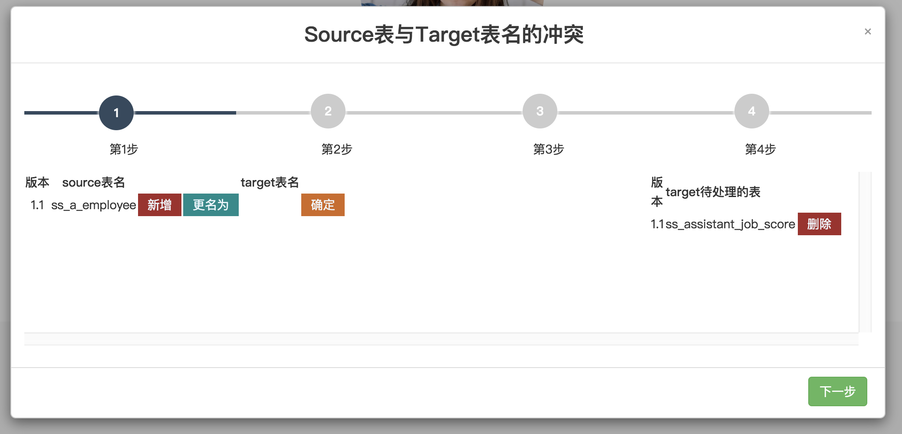

# db-smart-migrate-server
Table structure intelligent migration service
### scenes to be used
- When making collaborative changes to the MySQL table structure, I want to synchronously migrate the structural changes in the library in the dev environment to the test environment for intelligent migration. And archive the changed SQL records as required. Download for inspection and then execute online.
- Provides comparison steps according to tables, fields, and indexes to show which ones are newly added, which ones are deleted, and which ones are manually selected page requirements that need to be renamed. Similar to git merging conflicting code.
- I want to manage SQL changes in a unified manner on a fixed release date to reduce the workload of multiple people developing and recording SQL.
#### Pain points solved
- When each MySQL client performs table synchronization, it will lose fewer tables and columns in the left database than in the right database;
- Cannot solve the usage scenarios of table renaming, field renaming, and index renaming;
- There is no manual option to decide what to do with it yourself.
- You cannot intuitively feel what changes have been made, and the changed contents cannot be generated into SQL files for backup and manual editing and execution.
- Row data may also be overwritten, causing problems with string data in different environments.

### Features
- Content items that support migration include: database tables, table attributes, column names, column attributes, index names, and index attributes. Foreign keys are not currently supported.
- If the field attribute is not null, automatic migration will not prompt a conflict.
- Provides a conflict detection function similar to Git, which prompts conflicts for tables, columns, and indexes, and decides how to handle them.
- Processing options include:
    * Added [Add this change to the right library]
    * Renamed [Rename the change of the right library to the table name, field name or index name of the left library]
    * Delete [delete more tables, fields, or indexes in the right database than the left database]
- Change the content and generate a version of the SQL file with each click. Available for download.
- No changes are made to table data to ensure data security.
- Currently only supports Mysql.

<br/>
#### Environment
- Using Java 8
- Using SpringBoot 1.5.9.RELEASE
- Use Flyway to control versions

### tutorial
##### &emsp;A. configuration
1. If you config single database schema: <br/>
   rule:

     ```  name_spaces:
            schema_name: 
              source:
                datasource:
                  url: ${source_1_url:jdbc:mysql://test:3306/database_name?characterEncoding=utf-8&useSSL=false}
                  username: ${source_1_username:root}
                  password: ${source_1_password:123456}
                  driver-class-name: com.mysql.jdbc.Driver
              target:
                datasource:
                  url: ${target_1_url:jdbc:mysql://dev:3306/database_name?characterEncoding=utf-8&useSSL=false}
                  username: ${target_1_username:root}
                  password: ${target_1_password:123456}
                  driver-class-name: com.mysql.jdbc.Driver
        #   schema_name-mysql:
        #     source:
        #       datasource:
        #         url: ${source_1_url:jdbc:mysql://test:3306/database_name-mysql?characterEncoding=utf-8&useSSL=false}
        #         username: ${source_1_username:root}
        #         password: ${source_1_password:123456}
        #         driver-class-name: com.mysql.jdbc.Driver
        #     target:
        #       datasource:
        #         url: ${target_1_url:jdbc:mysql://dev:3306/database_name-mysql?characterEncoding=utf-8&useSSL=false}
        #         username: ${target_1_username:root}
        #         password: ${target_1_password:123456}
        #         driver-class-name: com.mysql.jdbc.Driver
     
     ```


2. If you config more database schemas   Then just release the #s


#### 使用说明

1. use in IDEA or  Eclipse run  src/main/java/com/system/DBVersionControlServerApplication <br/>

2. copy this url  http://localhost:8081/ to any browser <br/>
   login username and password is  admin/123456
   step one : click <font color=#008000 >结构同步</font>  to start  ，click  <font color=#008000 >开始</font>  弹出页面，根据自己需求进行操作，完成后，点击 <font color=#008000 >迁移</font>
   At this time, a new version will be generated, and the new SQL file will be available for download and  。
   3.<br/>
   4.<br/>
   5.<br/>
   6.<br/>
   7.<br/>
   8.<br/>
   9.<br/>


### 注意事项

### 问题反馈
Email ： 757761927@qq.com
微信 ：qiuqiu757761927