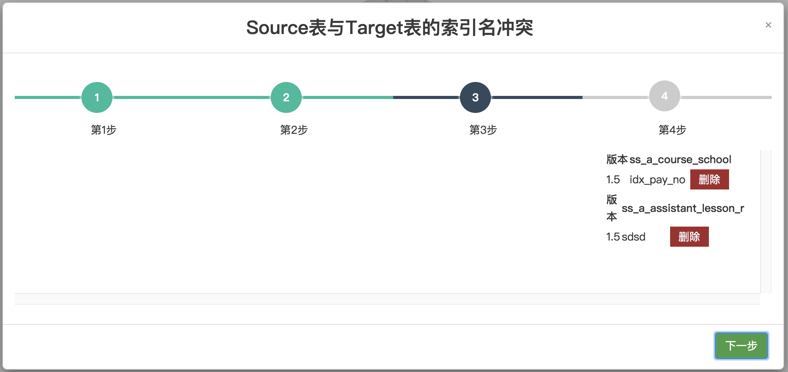

# db-control-version-server
#### 介绍
数据库结构变更自定义同步工具(表数据无损)
- 解决数据库不同环境（比如dev、test环境） ，当开发完成时，dev环境数据库相比test环境的变化，将变化的内容（表、字段、索引）以sql 的形式记录保存，并可以手动迁移dev环境的变更到test环境。
- 变更（新增、修改、改名、删除） 表、字段、索引时，将变更内容生成文件，记录下来，可以下载，可以同步到目标库。
- 同步任意两个环境之间的两个schema 的表，列，索引信息,但不损原本的表数据，表数据内容不变。<br/>
- 取代 Navicat结构同步功能，解决如果源表的列比目标表少，Navicat结构同步功能会造成数据被删除的问题。<br/>
- 解决不同环境之间数据库表结构差异问题。<br/>
- source schema 为已经变化的一方，如dev; target schema 为将要去变化的一方，如test; 选择要同步的变动，提供有页面交互按钮(如下图)。<br/>
- 提供每次同步的差异结果，存为SQL文件，做版本管理。<br/>
- 同步的内容项有： 数据库表，表属性，列名，列属性，索引名，索引属性。<br/>
- 目前仅支持Mysql。
<br/>
#### 软件架构
- 使用SpringBoot 1.5.9.RELEASE
- 使用 Flyway 控制版本


#### 安装教程

##### &emsp;A. 配置
   1. 如果要配置单个数据库 schema: <br/>
       规则: 
    
        ```  name_spaces:
               schema_name: 
                 source:
                   datasource:
                     url: ${source_1_url:jdbc:mysql://test:3306/database_name?characterEncoding=utf-8&useSSL=false}
                     username: ${source_1_username:root}
                     password: ${source_1_password:123456}
                     driver-class-name: com.mysql.jdbc.Driver
                 target:
                   datasource:
                     url: ${target_1_url:jdbc:mysql://dev:3306/database_name?characterEncoding=utf-8&useSSL=false}
                     username: ${target_1_username:root}
                     password: ${target_1_password:123456}
                     driver-class-name: com.mysql.jdbc.Driver
           #   schema_name-mysql:
           #     source:
           #       datasource:
           #         url: ${source_1_url:jdbc:mysql://test:3306/database_name-mysql?characterEncoding=utf-8&useSSL=false}
           #         username: ${source_1_username:root}
           #         password: ${source_1_password:123456}
           #         driver-class-name: com.mysql.jdbc.Driver
           #     target:
           #       datasource:
           #         url: ${target_1_url:jdbc:mysql://dev:3306/database_name-mysql?characterEncoding=utf-8&useSSL=false}
           #         username: ${target_1_username:root}
           #         password: ${target_1_password:123456}
           #         driver-class-name: com.mysql.jdbc.Driver
        
        ```
        
        
2. 如果想配置多个数据库 schema   则放开注释即可


#### 使用说明

1. 使用IDEA 或 Eclipse 运行 src/main/java/com/system/DBVersionControlServerApplication <br/>
   
2. 本地访问 http://localhost:8081/<br/>
    登陆 用户名密码为 admin/123456
   第一步: 点击 <font color=#008000 >结构同步</font>   ，点击 <font color=#008000 >开始</font>  弹出页面，根据自己需求进行操作，完成后，点击 <font color=#008000 >迁移</font>
   此时会生成新的版本，和新的SQL文件可供下载查看 。
3.<br/>
4.<br/>
5.<br/>
6.<br/>
7.<br/>
8.<br/>
9.<br/>


#### 注意事项

#### 问题反馈
 Email ： 757761927@qq.com 
